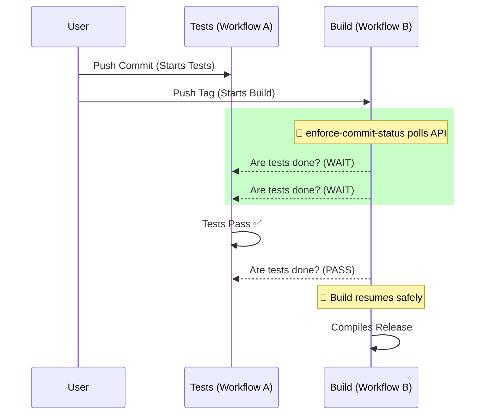

# Enforce Commit Status

A synchronous gatekeeper action that suspends your GitHub Actions runner until a specific workflow (like your test suite) completes on the target commit. 

## Why Use This Action?

In highly decoupled architectures, you might have separate workflows for distinct lifecycle events:
* **Workflow A (Tests)**: Executes automatically whenever a commit is pushed.
* **Workflow B (Build/Deploy)**: Executes automatically whenever a Git Tag is created.

**The Problem**: Tag creation is completely asynchronous from test execution. If you push a commit and immediately push a tag, Workflow B will begin building and deploying your code *before* Workflow A has actually finished validating the tests. This creates a race condition where you might accidentally release broken code.

**The Solution**: `enforce-commit-status` acts as a synchronous gatekeeper. By dropping this action into the very first step of Workflow B, it will safely poll the GitHub API and suspend the build until Workflow A explicitly returns a `success` conclusion for that specific commit. If the tests fail or time out, the build is immediately halted.



## How to Use It

Drop the `enforce-commit-status` action into your build or deployment workflow before any compilation steps occur.

```yaml
name: Release Build
on:
  push:
    tags:
      - 'v*.*.*'

permissions:
  actions: read
  contents: read

jobs:
  verify-and-build:
    runs-on: ubuntu-latest
    steps:
      - name: Checkout Code
        uses: actions/checkout@v4
        with:
          fetch-depth: 0 # Required if resolving annotated tags

      - name: Await PR Tests Completion
        uses: VitaliiLazebnyi/enforce-commit-status@v1
        with:
          github-token: ${{ secrets.GITHUB_TOKEN }}
          workflow-id: 'tests.yml'   # The filename of your test workflow
          poll-interval: '15s'       # How frequently to poll the API
          timeout: '45m'             # Maximum time to wait before failing

      - name: Build and Deploy
        run: npm run build
```

## Inputs

| Input | Required | Default | Description |
| --- | --- | --- | --- |
| `workflow-id` | **Yes** | - | Filename or ID of the Tests workflow (e.g., `tests.yml`). |
| `commit-sha` | No | `${{ github.sha }}` | Target Commit SHA. Automatically resolves annotated tags. |
| `github-token` | No | `${{ github.token }}` | Authentication token for the Actions API. |
| `poll-interval` | No | `15s` | Polling frequency. Minimum allowed is `10s`. |
| `timeout` | No | `1h` | Maximum suspension duration before throwing an error. |

## Outputs

| Output | Description |
| --- | --- |
| `final-status` | Resolved conclusion (`success`, `failure`, `timeout`). |
| `run-url` | HTML URL of the matched test run. |

## Additional Documentation

Please refer to [`REQUIREMENTS.md`](REQUIREMENTS.md) for the complete, codified technical specification and state matrix logic.
